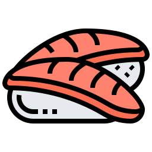

# HTML & CSS Analysis Exercise

## Source Files: Super Jap - Japanese Cooking Courses Website

---

# PART 1: HTML FUNDAMENTALS

## Document Structure

### Q1. What is the purpose of the `<!DOCTYPE html>` declaration?
**Answer:** It tells the browser that this document is an HTML5 document. Without it, browsers may render the page in "quirks mode," which can cause inconsistent styling and layout behavior. It must be the very first line of an HTML document.

---

### Q2. What does the `lang="en"` attribute do in the `<html>` tag?
**Answer:** It declares the primary language of the document (English). This helps:
- Screen readers pronounce content correctly
- Search engines understand the page language
- Browsers offer translation services
- CSS `:lang()` selector to work properly

---

### Q3. Why is there a `<meta charset="UTF-8">` tag? What happens if we remove it?
**Answer:** UTF-8 is a character encoding that supports virtually all characters from all languages. Without it:
- Special characters (é, ñ, 日本語, emojis) might display as garbled text (�)
- The browser might guess the wrong encoding
- It should always be in the first 1024 bytes of the document

---

### Q4. What is the `<head>` section for? What elements can go inside it?
**Answer:** The `<head>` contains metadata about the document (not visible content). It can include:
- `<title>` - page title (shown in browser tab)
- `<meta>` - metadata (charset, viewport, description, keywords)
- `<link>` - external resources (CSS, favicon)
- `<script>` - JavaScript files
- `<style>` - embedded CSS
- `<base>` - base URL for relative links

---

### Q5. What is the difference between `<h1>` and `<h2>`? Why shouldn't we skip heading levels?
**Answer:** 
- `<h1>` is the main heading (highest importance), `<h2>` is a subheading
- Headings go from `<h1>` (most important) to `<h6>` (least important)
- Skipping levels (e.g., `<h1>` to `<h3>`) breaks the document outline and confuses:
  - Screen readers navigating by headings
  - Search engines understanding content hierarchy
  - Users scanning the page structure

---

### Q6. What is the purpose of the `alt` attribute on images?
**Answer:** The `alt` (alternative text) attribute:
- Displays when the image fails to load
- Is read aloud by screen readers for visually impaired users
- Helps search engines understand image content
- Is **required** for accessibility compliance (WCAG)
- Should describe the image content, not just "image" or "photo"

---

### Q7. In this page, is `alt="yummy"` a good alternative text? Why or why not?
**Answer:** No, it's a poor alt text because:
- It doesn't describe what's actually in the image
- "yummy" is subjective and doesn't help blind users understand the content
- Better alternatives: `alt="Bok choi stir-fry dish"` or `alt="Teriyaki chicken with vegetables"`

---

### Q8. What's the difference between the `<title>` tag and the `<h1>` tag?
**Answer:**
| `<title>` | `<h1>` |
|-----------|--------|
| Goes in `<head>` | Goes in `<body>` |
| Not visible on page | Visible on page |
| Shows in browser tab | Shows as main heading |
| Used by search engines as page title | Used as on-page heading |
| One per document (required) | One per document (recommended) |

---

## Semantic HTML

### Q9. List all semantic elements used in this page and explain their purpose.
**Answer:**
| Element | Purpose |
|---------|---------|
| `<header>` | Introductory content, typically contains logo, title, navigation |
| `<nav>` | Navigation links section |
| `<main>` | Main content of the page (unique content, not repeated across pages) |
| `<section>` | Thematic grouping of content |
| `<article>` | Self-contained, independently distributable content |
| `<aside>` | Content tangentially related to main content (sidebar) |
| `<figure>` | Self-contained content like images, diagrams, code |
| `<figcaption>` | Caption for a `<figure>` element |

---

### Q10. Why use `<figure>` and `<figcaption>` instead of just `` with a `<p>` below it?
**Answer:**
- `<figure>` semantically groups the image with its caption
- Screen readers understand they're related
- The caption can appear before or after the image
- It can contain multiple images with one caption
- Better for SEO as search engines understand the relationship
- Example of incorrect approach:
```html
<!-- Bad -->

<p>Caption text</p>

<!-- Good -->
<figure>
    
    <figcaption>Caption text</figcaption>
</figure>
```

---

### Q11. What's the difference between `<section>` and `<article>`?
**Answer:**
| `<section>` | `<article>` |
|-------------|-------------|
| Generic thematic grouping | Self-contained, distributable content |
| Needs context from parent | Makes sense on its own |
| Example: chapters of a book | Example: blog post, news article, product card |
| Usually has a heading | Should have a heading |

In this page: `<article>` is used for course listings (each could stand alone), `<section>` groups the articles and the popular recipes sidebar.

---

### Q12. What's the difference between `<section>` and `<div>`?
**Answer:**
| `<section>` | `<div>` |
|-------------|---------|
| Semantic meaning (thematic grouping) | No semantic meaning |
| Should have a heading | No heading requirement |
| Appears in document outline | Doesn't affect outline |
| Use when content is thematically related | Use for styling/layout only |

Rule: If you can't think of a heading for it, use `<div>` instead of `<section>`.

---

### Q13. Why is `<main>` used? Can we have multiple `<main>` elements on a page?
**Answer:**
- `<main>` represents the dominant content unique to this page
- Only **one visible** `<main>` per page (you can have others with `hidden` attribute)
- Should not include content repeated across pages (header, footer, nav, sidebar)
- Helps screen readers jump directly to main content
- In this page, the sidebar (`<aside>`) probably shouldn't be inside `<main>`

---

### Q14. The navigation uses `<ul>` and `<li>`. Why use a list for navigation links?
**Answer:**
- Navigation is semantically a list of links
- Screen readers announce "list with 5 items" helping users know what to expect
- Provides structure even if CSS fails to load
- Easy to style horizontally or vertically
- Keyboard navigation works predictably
- Standard convention that all developers recognize

---

### Q15. Should the `<nav>` be inside or outside the `<header>`? Does it matter?
**Answer:** Both are valid:
- **Inside header**: If navigation is part of the site branding/header area
- **Outside header**: If navigation is a distinct section

In this page, `<nav>` is outside `<header>`, which is fine. Common patterns include:
```html
<!-- Pattern 1: Nav inside header -->
<header>
    <logo>
    <nav>...</nav>
</header>

<!-- Pattern 2: Nav outside header (this page) -->
<header>...</header>
<nav>...</nav>
```

---

### Q16. What is the `<aside>` element for? Is its placement correct in this page?
**Answer:**
- `<aside>` is for content tangentially related to the main content
- Typical uses: sidebars, pull quotes, advertising, related links
- In this page, it contains "Popular Recipes" which is related but secondary
- **Issue**: It's inside `<main>`, but arguably should be outside since sidebars are often repeated across pages

---

## Links and Paths

### Q17. What does `href="#"` mean in the navigation links?
**Answer:**
- `#` is a placeholder link that goes nowhere (stays on same page)
- Scrolls to the top of the page when clicked
- Used during development before real URLs are known
- Better alternative for prototypes: `href="#0"` or `javascript:void(0)` (though `#` is most common)

---

### Q18. The CSS file is linked as `href="css/style.css"`. What folder structure does this expect?
**Answer:**
```
project/
├── index.html
├── css/
│   └── style.css
└── images/
    ├── tuna.png
    ├── bok-choi.jpg
    ├── teriyaki.jpg
    ├── dark-wood.jpg
    └── ricepaper-black.jpg
```

---

### Q19. What's the difference between relative and absolute paths? Give examples from this page.
**Answer:**
| Type | Example | Description |
|------|---------|-------------|
| Relative | `css/style.css` | Relative to current file location |
| Relative | `images/tuna.png` | Relative to current file location |
| Absolute | `/css/style.css` | From website root |
| Full URL | `https://example.com/style.css` | Complete web address |

All paths in this page are relative, which is common for project files.

---

### Q20. If you moved index.html into a folder called "pages", what would you need to change?
**Answer:** All relative paths would need updating:
```html
<!-- Before (index.html in root) -->
<link rel="stylesheet" href="css/style.css">


<!-- After (index.html in pages/) -->
<link rel="stylesheet" href="../css/style.css">

```
The `../` means "go up one directory level."

---

# PART 2: CSS FUNDAMENTALS

## Selectors

### Q21. What does `header > img` select? How is it different from `header img`?
**Answer:**
| Selector | Meaning |
|----------|---------|
| `header > img` | Direct child only (img must be immediately inside header) |
| `header img` | Any descendant (img anywhere inside header, any depth) |

```html
<header>
     <!-- Matched by both -->
    <div>
         <!-- Only matched by header img -->
    </div>
</header>
```

---

### Q22. Explain the selector `nav li a`. What elements does it target?
**Answer:**
- Targets: `<a>` elements inside `<li>` elements inside `<nav>`
- It's a descendant selector (space = descendant)
- Reads right to left: "find all `<a>` tags that have an `<li>` ancestor that has a `<nav>` ancestor"
- In this page: selects all 5 navigation links

---

### Q23. What does `nav li:hover a` do? Why do we need to target the `<a>` inside the hovered `<li>`?
**Answer:**
- Selects `<a>` elements inside `<li>` elements that are being hovered
- We need this because:
  - The hover effect is on `<li>` (background color changes)
  - But we want to change the link color too
  - `nav li:hover` changes the `<li>`, `nav li:hover a` changes the `<a>` inside it
- This ensures the text color changes when hovering anywhere on the `<li>`, not just on the link text

---

### Q24. What's the difference between `.stage` and `.stage > article`?
**Answer:**
| Selector | Meaning |
|----------|---------|
| `.stage` | Element with class "stage" |
| `.stage > article` | `<article>` elements that are direct children of `.stage` |

```html
<section class="stage">
    <article>Matched by .stage > article</article>
    <div>
        <article>NOT matched (not direct child)</article>
    </div>
</section>
```

---

### Q25. Write a selector that would select only the first `<li>` in the navigation.
**Answer:** Several options:
```css
nav li:first-child { }
nav ul li:first-of-type { }
nav li:nth-child(1) { }
```

---

### Q26. How would you select all navigation links except the first one?
**Answer:**
```css
nav li:not(:first-child) a { }
/* or */
nav li:nth-child(n+2) a { }
/* or */
nav li + li a { }  /* li that follows another li */
```

---

### Q27. What is selector specificity? Rank these selectors from lowest to highest specificity:
- `nav li a`
- `.popular a`
- `#main-nav a`
- `a`
- `nav ul li a`

**Answer:** From lowest to highest:
1. `a` — (0,0,1) - 1 element
2. `nav li a` — (0,0,3) - 3 elements
3. `nav ul li a` — (0,0,4) - 4 elements
4. `.popular a` — (0,1,1) - 1 class + 1 element
5. `#main-nav a` — (1,0,1) - 1 ID + 1 element

Specificity format: (IDs, Classes, Elements)

---

## Box Model

### Q28. In the body rule, what does `margin: 10px auto` do? Why does it center the page?
**Answer:**
- `margin: 10px auto` means:
  - Top and bottom: 10px
  - Left and right: auto
- `auto` margins split available horizontal space equally
- Combined with `width: 1000px`, this centers the body
- Only works for block elements with a defined width
- Doesn't work for vertical centering (auto top/bottom = 0)

---

### Q29. What's the difference between `margin` and `padding`?
**Answer:**
| Margin | Padding |
|--------|---------|
| Outside the border | Inside the border |
| Space between elements | Space inside element |
| Can be negative | Cannot be negative |
| Can use `auto` | Cannot use `auto` |
| Transparent (shows parent background) | Shows element's background |
| Can collapse vertically | Never collapses |

---

### Q30. Explain margin collapsing. Does it happen anywhere in this page?
**Answer:**
Margin collapsing: When vertical margins of adjacent elements combine into one margin (the larger one wins).

Rules:
- Only vertical margins collapse (not horizontal)
- Only adjacent margins (no border/padding between)
- Parent-child margins can collapse if no border/padding separates them

In this page: `nav ul { margin: 0 0; }` prevents collapsing with nav element.

---

### Q31. What does `padding: 10px 35px` mean?
**Answer:**
- Two values: `padding: [top/bottom] [left/right]`
- So: 10px top and bottom, 35px left and right
- Full syntax options:
  - 1 value: all sides
  - 2 values: vertical | horizontal
  - 3 values: top | horizontal | bottom
  - 4 values: top | right | bottom | left (clockwise)

---

### Q32. The `.stage > article` has `gap: 12px`. What does this do and where can it be used?
**Answer:**
- `gap` creates space between flex/grid items
- Only works on flex and grid containers (the parent, not children)
- `gap: 12px` = 12px between all items
- Can also use `row-gap` and `column-gap` separately
- Better than margins because:
  - No margin on outer edges
  - No double margins between items
  - Cleaner code

---

## Layout (Flexbox)

### Q33. What does `display: flex` do on the `header` element?
**Answer:**
- Makes header a flex container
- Direct children become flex items
- Children align in a row by default (main axis = horizontal)
- Enables flex properties on children
- In this page: places logo and text div side by side

---

### Q34. What does `align-items: center` achieve in the header?
**Answer:**
- Vertically centers flex items on the cross axis
- Cross axis = perpendicular to main axis (vertical when row direction)
- Centers the logo and text div vertically within the header
- Without it, items would stretch to fill the header height (default: `stretch`)

---

### Q35. Why does the `<main>` element use `display: flex`? What layout does it create?
**Answer:**
- Creates a two-column layout
- `.stage` section (78% width) on the left
- `<aside>` on the right
- Flex items sit side by side in a row
- This is a common pattern for main content + sidebar layouts

---

### Q36. What's the default `flex-direction`? How would the layout change if we set `flex-direction: column` on main?
**Answer:**
- Default: `flex-direction: row` (horizontal)
- With `column`: 
  - Items stack vertically
  - Stage would be above aside
  - Would create a single-column layout
  - The 78% width would still apply but aside would be full width

---

### Q37. Explain `display: inline-block` on `nav li`. What would happen with just `inline` or `block`?
**Answer:**
| Value | Behavior |
|-------|----------|
| `block` | Each li on new line, full width |
| `inline` | Side by side, but can't set width/height/vertical margins |
| `inline-block` | Side by side AND can set dimensions |

`inline-block` is perfect for horizontal navigation: items flow like text but accept box model properties.

---

### Q38. Could we use `display: flex` on the `<nav>` instead of `inline-block` on list items? How?
**Answer:** Yes:
```css
nav ul {
    display: flex;
    margin: 0;
    padding: 0;
}
nav li {
    /* Remove display: inline-block */
    list-style-type: none;
}
```
Benefits of flex:
- More control over spacing (`gap`, `justify-content`)
- Easier to center or distribute items
- More modern approach

---

## Colors and Backgrounds

### Q39. The CSS uses `rgb(255, 229, 219)` and `darksalmon`. What are the different ways to specify colors in CSS?
**Answer:**
| Method | Example | Notes |
|--------|---------|-------|
| Named colors | `darksalmon`, `white` | ~140 predefined names |
| Hex | `#fff`, `#ffffff` | 3 or 6 characters |
| RGB | `rgb(255, 229, 219)` | Red, Green, Blue (0-255) |
| RGBA | `rgba(255, 229, 219, 0.5)` | RGB + Alpha (transparency) |
| HSL | `hsl(14, 100%, 93%)` | Hue, Saturation, Lightness |
| HSLA | `hsla(14, 100%, 93%, 0.5)` | HSL + Alpha |

---

### Q40. What's the difference between `background-color` and `background-image`?
**Answer:**
| `background-color` | `background-image` |
|--------------------|-------------------|
| Solid color | Image file or gradient |
| Below any image | Renders on top of color |
| Single value | Can have multiple images |
| Always visible | May fail to load |

Best practice: Set a `background-color` as fallback when using `background-image`.

---

### Q41. The body has both `background-color` and the html has `background-image`. How do these interact?
**Answer:**
- `html` has dark wood background image
- `body` has white background color
- Body is 1000px wide and centered
- Result: white content area with wood visible on sides
- This creates a "page on wood table" effect
- If body had no background, html's wood would show through

---

### Q42. What happens if the `dark-wood.jpg` image is missing? How would the page look?
**Answer:**
- Background would be transparent (no html background-color set)
- Would show browser default background (usually white)
- Best practice: Always set a fallback color:
```css
html {
    background-color: #3d2b1f; /* Brown fallback */
    background-image: url("images/dark-wood.jpg");
}
```

---

## Typography

### Q43. What does `font-family: sans-serif` mean?
**Answer:**
- Uses the browser's default sans-serif font
- Sans-serif = without decorative strokes (Arial, Helvetica, etc.)
- It's a generic family name (fallback)
- Better practice: specify fonts with fallbacks:
```css
font-family: "Helvetica Neue", Arial, sans-serif;
```

---

### Q44. What's the difference between `serif` and `sans-serif` fonts?
**Answer:**
| Serif | Sans-serif |
|-------|------------|
| Has small strokes/feet on letters | Clean lines, no strokes |
| Traditional, formal feel | Modern, clean feel |
| Examples: Times, Georgia | Examples: Arial, Helvetica |
| Often used for body text in print | Often used for screens |

---

### Q45. What does `line-height: 0px` do in `.popular ul li a`? Why is this unusual?
**Answer:**
- Sets line height to 0 (no space for text)
- Combined with `height: 15px` and `padding: 35px 0 0 10px`
- Creates a button-like clickable area
- Text appears via padding, not line height
- This is a hack for creating specific hit areas
- **Not recommended**: Better to use normal padding and line-height

---

## The Cascade

### Q46. There are two rules for `nav li a`. How does the browser decide which styles to apply?
**Answer:**
```css
nav li a {
    display: inline-block;
    padding: 10px 35px;
}
nav li a {
    color: darksalmon;
    text-decoration: none;
}
```
- Both rules have same specificity (0,0,3)
- Browser applies BOTH rules (they don't conflict)
- If they had the same property, the later one would win
- These complement each other (different properties)
- Could be combined into one rule for cleaner code

---

### Q47. If we added `a { color: blue; }` to the CSS, would navigation links be blue or darksalmon?
**Answer:**
- Darksalmon wins
- Specificity comparison:
  - `a` = (0,0,1)
  - `nav li a` = (0,0,3)
- Higher specificity wins regardless of order
- The more specific selector always takes precedence

---

### Q48. What does `!important` do? Why should it be used sparingly?
**Answer:**
- `!important` overrides all other declarations
- Example: `color: blue !important;`
- Problems:
  - Breaks natural cascade
  - Hard to override later
  - Makes debugging difficult
  - Can only be overridden by another `!important`
- Use only for: utility classes, overriding inline styles, or as last resort

---

# PART 3: DEBUGGING & PROBLEM SOLVING

### Q49. If the navigation links don't change color on hover, what could be wrong?
**Answer:** Possible causes:
1. CSS file not loaded (check path)
2. Selector typo (`nav li:hover a` vs `nav:hover li a`)
3. More specific selector elsewhere overriding it
4. Missing `:hover` pseudo-class
5. Browser caching old CSS
6. CSS rule order issue (if same specificity)

Debug steps: Check DevTools > Elements > Computed styles

---

### Q50. The aside has `border-left: 1px solid #CCC`. Why might this border not be visible?
**Answer:** Possible causes:
1. Aside has no height (no content)
2. Parent (`main`) doesn't have `display: flex` applied
3. Background color same as border color
4. Aside is hidden or has `display: none`
5. Border is there but very light (#CCC on white)
6. Element is collapsed due to float issues

---

### Q51. If images don't display, list at least 5 possible causes.
**Answer:**
1. Wrong file path (case-sensitive on Linux servers!)
2. File doesn't exist or wrong filename
3. File extension mismatch (.jpg vs .jpeg vs .JPG)
4. Images folder in wrong location
5. Missing file permissions on server
6. Image file is corrupted
7. `display: none` applied via CSS
8. `width` or `height` set to 0
9. Parent container has `overflow: hidden` with small size
10. Image blocked by browser security or ad blocker

---

### Q52. The CSS uses `width: 78%` for `.stage`. 78% of what?
**Answer:**
- 78% of the parent element's content width
- Parent is `<main>` which is inside `<body>`
- Body is 1000px wide
- But `<main>` has no explicit width, so it fills body
- Actual stage width ≈ 780px (minus any margins/borders)
- Note: padding and border don't affect percentage calculation (unless box-sizing: border-box)

---

### Q53. Why do the articles inside `.stage` sit side by side internally? (figure + div)
**Answer:**
```css
.stage > article {
    display: flex;
    gap: 12px;
}
```
- `display: flex` makes article a flex container
- `<figure>` and `<div>` are flex items
- They sit in a row (default flex-direction)
- `gap: 12px` adds space between them
- This creates image-on-left, text-on-right layout

---

# PART 4: BEST PRACTICES & IMPROVEMENTS

### Q54. Is this page responsive? What would you add to make it work on mobile?
**Answer:** 
No, it's not responsive:
- Fixed `width: 1000px` on body
- No `<meta name="viewport">` tag
- No media queries

To fix:
```html
<meta name="viewport" content="width=device-width, initial-scale=1">
```
```css
body {
    width: 100%;
    max-width: 1000px;
}
@media (max-width: 768px) {
    main { flex-direction: column; }
    .stage { width: 100%; }
    nav li { display: block; }
}
```

---

### Q55. What is the viewport meta tag and why is it essential for mobile?
**Answer:**
```html
<meta name="viewport" content="width=device-width, initial-scale=1">
```
- Tells mobile browsers to use device width (not 980px default)
- `initial-scale=1` prevents initial zoom
- Without it:
  - Mobile shows desktop site zoomed out
  - Media queries won't trigger properly
  - Touch targets too small
- **This page is missing it!**

---

### Q56. List 5 accessibility improvements for this page.
**Answer:**
1. **Better alt text**: Replace "yummy" with actual descriptions
2. **Skip navigation link**: Add link to jump to main content
3. **Focus states**: Add visible `:focus` styles for keyboard users
4. **ARIA landmarks**: Already using semantic HTML (good!)
5. **Color contrast**: Check if darksalmon on light background passes WCAG
6. **Link text**: Replace "menu" with descriptive text
7. **Language**: Add `lang="ja"` for Japanese text if present
8. **Heading hierarchy**: Ensure no skipped heading levels
9. **Form labels**: If forms are added later
10. **Touch targets**: Make nav links at least 44x44px for mobile

---

### Q57. The body has a fixed `width: 1000px`. What are the pros and cons?
**Answer:**
| Pros | Cons |
|------|------|
| Predictable layout | Not responsive |
| Easy to design | Horizontal scroll on small screens |
| Consistent look | Wasted space on large screens |
| Less testing needed | Poor mobile experience |
| Matches design mockup | Accessibility issues |

Modern approach: Use `max-width: 1000px` instead of `width: 1000px`.

---

### Q58. Find CSS properties that could be simplified or combined.
**Answer:**
```css
/* Original - two separate rules */
nav li a{
    display: inline-block;
    padding: 10px 35px;
}
nav li a{
    color: darksalmon;
    text-decoration: none;
}

/* Combined */
nav li a {
    display: inline-block;
    padding: 10px 35px;
    color: darksalmon;
    text-decoration: none;
}

/* margin: 0 0 could be just margin: 0 */
nav ul { margin: 0; }

/* Shorthand for padding */
header > div { margin-left: 20px; }
header > img { margin-left: 20px; }
/* Could use a class or combined selector */
```

---

### Q59. What CSS reset or normalization would help this page?
**Answer:**
Browsers have default styles that vary. A reset helps:

```css
/* Minimal reset */
* {
    margin: 0;
    padding: 0;
    box-sizing: border-box;
}

img {
    max-width: 100%;
    height: auto;
}

/* Or use a library like normalize.css */
```

Benefits of `box-sizing: border-box`:
- Padding and border included in width
- Easier percentage calculations
- More predictable layouts

---

### Q60. How could you improve the navigation hover effect?
**Answer:**
Current issues:
- No transition (abrupt color change)
- No focus state for keyboard users
- Links don't fill full height of nav

Improved CSS:
```css
nav li a {
    display: inline-block;
    padding: 10px 35px;
    color: darksalmon;
    text-decoration: none;
    transition: background-color 0.3s, color 0.3s;
}

nav li a:hover,
nav li a:focus {
    background-color: lightsalmon;
    color: white;
    outline: none;
}

nav li a:focus-visible {
    outline: 2px solid darkblue;
    outline-offset: 2px;
}
```

---

# PART 5: ADVANCED QUESTIONS

### Q61. Explain the CSS box model. How does it apply to the article figures?
**Answer:**
```css
.stage > article > figure {
    border: 1px solid lightgray;
    padding: 5px;
    margin: 0;
}
```

Box model layers (inside to outside):
1. **Content**: The image
2. **Padding**: 5px on all sides
3. **Border**: 1px lightgray
4. **Margin**: 0

Total size = content + padding + border + margin
With default `box-sizing: content-box`: padding and border add to width
With `box-sizing: border-box`: padding and border included in width

---

### Q62. What is the Document Object Model (DOM)? How does it relate to HTML?
**Answer:**
- DOM = browser's representation of the HTML document
- Tree structure of objects (nodes)
- Each HTML element becomes a DOM node
- JavaScript can manipulate the DOM
- CSS selectors traverse the DOM tree
- Example tree for this page:
```
document
└── html
    ├── head
    │   └── title, meta, link
    └── body
        ├── header
        │   ├── img
        │   └── div
        │       ├── h1
        │       └── h2
        ├── nav
        └── main
```

---

### Q63. What are pseudo-classes and pseudo-elements? Give examples from this page.
**Answer:**
**Pseudo-classes** (select state):
- `:hover` - used on `nav li:hover`
- Others: `:focus`, `:active`, `:first-child`, `:nth-child()`

**Pseudo-elements** (select part of element):
- `::before`, `::after` - not used in this page
- `::first-letter`, `::first-line`

Syntax difference:
- Pseudo-classes: single colon `:hover`
- Pseudo-elements: double colon `::before` (CSS3)

---

### Q64. How would you add a simple animation to the navigation links?
**Answer:**
```css
nav li a {
    transition: all 0.3s ease;
}

/* Or more specific */
nav li a {
    transition: color 0.3s ease, background-color 0.3s ease;
}

/* Or with keyframes */
@keyframes pulse {
    0% { transform: scale(1); }
    50% { transform: scale(1.05); }
    100% { transform: scale(1); }
}

nav li a:hover {
    animation: pulse 0.5s ease;
}
```

---

### Q65. What is the difference between `display: none` and `visibility: hidden`?
**Answer:**
| `display: none` | `visibility: hidden` |
|-----------------|---------------------|
| Removes from layout | Keeps space in layout |
| Not accessible to screen readers | Still takes up space |
| Cannot be animated with transitions | Can be animated |
| Click events don't fire | Click events don't fire |
| Children also hidden | Children can be visible |

Also consider: `opacity: 0` (invisible but interactive, animatable)

---

### Q66. How does the browser render this page? Describe the basic steps.
**Answer:**
1. **Parse HTML** → Build DOM tree
2. **Parse CSS** → Build CSSOM (CSS Object Model)
3. **Combine** → Build Render Tree (visible elements only)
4. **Layout** → Calculate positions and sizes
5. **Paint** → Draw pixels to screen
6. **Composite** → Layer and display

This happens very fast but can be triggered again by:
- Changing DOM (reflow)
- Changing styles (repaint)
- Animations (composite)

---

### Q67. What are CSS custom properties (variables)? How could they improve this CSS?
**Answer:**
```css
:root {
    --primary-color: darksalmon;
    --primary-light: lightsalmon;
    --bg-light: rgb(255, 229, 219);
    --text-dark: #333;
    --spacing: 10px;
}

nav {
    background-color: var(--bg-light);
}

nav li a {
    color: var(--primary-color);
}

nav li:hover {
    background-color: var(--primary-light);
}
```

Benefits:
- Single source of truth for colors
- Easy theme changes
- Can be changed with JavaScript
- Reduce repetition

---

### Q68. What is the "cascading" in Cascading Style Sheets?
**Answer:**
The cascade determines which styles apply when multiple rules target the same element:

1. **Origin**: User agent < User < Author
2. **Specificity**: ID > Class > Element
3. **Order**: Later rules override earlier (same specificity)

Plus:
- `!important` overrides normal cascade
- Inline styles beat stylesheets (unless !important)
- Inherited properties have lowest priority

---

### Q69. How would you structure the CSS file better using comments and organization?
**Answer:**
```css
/* ==========================================================================
   1. RESET & BASE STYLES
   ========================================================================== */
* { box-sizing: border-box; }

/* ==========================================================================
   2. TYPOGRAPHY
   ========================================================================== */
body { font-family: sans-serif; }

/* ==========================================================================
   3. LAYOUT
   ========================================================================== */
body { width: 1000px; margin: 10px auto; }
main { display: flex; }

/* ==========================================================================
   4. COMPONENTS
   ========================================================================== */

/* 4.1 Header */
header { ... }

/* 4.2 Navigation */
nav { ... }

/* 4.3 Articles */
.stage > article { ... }

/* 4.4 Sidebar */
aside { ... }
.popular { ... }

/* ==========================================================================
   5. UTILITIES
   ========================================================================== */

/* ==========================================================================
   6. MEDIA QUERIES
   ========================================================================== */
```

---

### Q70. What are some modern CSS features not used in this page that could improve it?
**Answer:**
1. **CSS Grid**: Better for overall page layout
2. **CSS Custom Properties**: For theming
3. **Flexbox gap**: Used, but could use more
4. **clamp()**: For responsive sizing
5. **aspect-ratio**: For images
6. **min()**, **max()**: For responsive widths
7. **Container queries**: Component-based responsive design
8. **:is()**, **:where()**: Simpler selectors
9. **Logical properties**: `margin-inline`, `padding-block`
10. **prefers-color-scheme**: Dark mode support

Example improvement:
```css
body {
    width: min(1000px, 100% - 2rem);
}

img {
    aspect-ratio: 16 / 9;
    object-fit: cover;
}
```

---

# PRACTICAL EXERCISES

### Exercise 1: Fix the Mobile View
Add the necessary CSS to make this page work on screens less than 768px wide.

### Exercise 2: Add a Footer
Create a footer with copyright information and social media links, styled consistently with the header.

### Exercise 3: Create a Dropdown Menu
Convert one of the navigation items into a dropdown menu using only CSS (`:hover` and positioning).

### Exercise 4: Improve Accessibility
Add ARIA attributes, improve color contrast, and ensure keyboard navigation works properly.

### Exercise 5: Add Dark Mode
Create a dark theme version using CSS custom properties and `prefers-color-scheme` media query.

---

*End of Question Bank*
